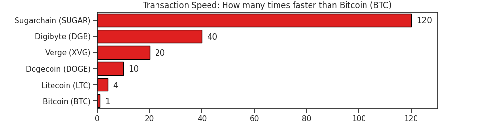

Sugarchain
==========
one-CPU-one-vote, the world’s fastest PoW blockchain  
https://sugarchain.org


TL;DR
-----
- The world's fastest PoW blockchain
  * Sugarchain is 120x faster than Bitcoin, 30x faster than Litecoin and 12x faster than Dogecoin.
- The first blockchain to have Native SegWit (Bech32) built-in by default.
- The block reward halving is accurate, where block rewards are reduced exactly by half and have no rounding errors.
  * The most accurate halvings
  * Exact total supply
- Fair distribution and volunteer based.
  * NO Premine, NO Presale, NO Founder's rewards
- one-CPU-one-vote
  * YespowerSugar: Multi-threading resistance
  * NO GPU, NO ASIC


Introduction
------------
Sugarchain is a decentralized, peer-to-peer (P2P) digital currency and payment network supported by an open-source blockchain protocol, launched by Zenny Kim and Volodymyr Biloshytskyi on August 24, 2019. Through Sugarchain, users can make payments to anyone in the world at the highest speeds ***in 5 seconds***, and the lowest costs compared to other digital assets. For example, the transaction speed of Sugarchain is 120 times faster than Bitcoin, 30 times faster than Litecoin and 12 times faster than Dogecoin.

The Sugarchain Project emerged as an alternative solution to Bitcoin in light of early concerns over Bitcoin’s wait times in confirming block transactions and rounding errors in block reward halving. By introducing minor technical modifications to the original Bitcoin source code, Sugarchain allowed for much faster transaction speeds, even lower processing fees and has ***the most accurate block reward halving and total supply*** than any other digital asset, including Bitcoin. Sugarchain also launched following the ***one-CPU-one-vote*** idea proposed by Satoshi Nakamoto himself, thus making YespowerSugar GPU and ASIC resistant. It has also launched as being the first blockchain to have ***Native SegWit (Bech32)*** enabled by default.

As one of the successful derivatives of Bitcoin, Sugarchain is establishing its position as ***the world's fastest PoW blockchain***, complementing and reinforcing Bitcoin in purpose, function, and utility, and challenging our traditional notions of money. The Sugarchain Project has ***never been funded through an ICO or premine***, making it a fair launch. Sugarchain is an entirely community and voluntarily driven project, with no external company or funding supporting it apart from community funding.


Specifications
--------------
| | |
------------|------------
Block time: | `5` Seconds
Block reward: | `42.94967296` SUGAR
Halving interval: | `12,500,000` Blocks (approx. 2 years)
Total supply: | `1,073,741,824` SUGAR
PoW algorithm: | YespowerSugar (based on Yespower 1.0.1)
Difficulty: | SugarShield-N510 (based on Zcash's modification of Digishield)
Port: | 34230 / RPC 34229
Premine: | None: NO ICO, NO Presale, NO Founder's rewards


The world's fastest PoW blockchain
----------------------------------
- 5 seconds transaction speed:
  * 120x faster than Bitcoin
  * 30x faster than Litecoin
  * 12x faster than Dogecoin
- Transaction speed comparison:<br/>
  <!--  -->
  
- Don't worry about orphan blocks:
  * According to the testnet results, the average orphan rate is under 3% and no problems occur.


Native SegWit (Bech32)
----------------------
- The first blockchain to have Native SegWit (Bech32) built-in by default.
- Significantly faster and lower cost than legacy transaction.
- Very high probability of detection guaranteed.
- Structure<br/>
  <!--  -->
  


Better halving & Exact supply
-----------------------------
Halving is everything about limiting the total supply. Bitcoin is valuable because its total supply has been strictly limited, unlike traditional currencies. This total supply is controlled only by that halving. There is nothing else. We made this halving better.
- Block reward:
  * The block reward should be to a ***power of two***, so that it halves correctly.
  * `2^32/1e+8 = 42.94967296 SUGAR`
- Halving schedule:
  * Interval `12500000 blocks (5^8*32)` which is approx. 2 years (62,500,000 seconds).
  * The total number of times halving will occur is 33 times, over the span of approx. 66 years (34,375,000 minutes).
- Total supply:
  * `1073741824 SUGAR` in theory, and `1073741823.875 SUGAR` in actual.
  * The difference is `0.125 SUGAR`. One Satoshi (0.00000001) limitation makes this difference. In addition, this number is meaningful. FYI: `1 GB = 1073741824 Byte (2^30)`.
  * The total supply of Sugarchain is around 51 times greater than Bitcoin.
- Halving chart:<br/>
  
<!-- - Halving table: -->
- <details><summary>Halving table: <i>(click to expand)</i></summary><br/>

  

  </details>


one-CPU-one-vote
----------------
> “31/Oct/2008 Proof-of-work is essentially one-CPU-one-vote”

Satoshi Nakamoto talked about the importance of decentralized mining in his whitepaper. We want to create a blockchain that anyone can do mining easily without any entry barriers.
- CPU mining only
  * YespowerSugar (based on Yespower 1.0.1) is only for Sugarchain, not compatible with other Yespower coins.
  * The minimum difficulty (powlimit) is set low enough for two reasons. The first is to handle fast block time; The second is to allow mining on slow CPUs.
- Mining efficiency:
  * According to the test results, the most efficient is using ***half of threads*** on a single CPU.
  * YespowerSugar is more suitable for older CPUs, because it is essentially a ***multi-threading resistor***. Suitable for smartphones and Raspberry Pi.
- Benchmark<br/>
  
- NO GPU: GPU mining is not possible.
- NO ASIC: ASIC mining is not possible.


FAQ
---
- Disk space requirements:
  * Blockchain size growth is around `10 MB per day` and around 3.65 GB per year.
- Network rules:
  * To prevent fraud and timestamp attacks, nodes should be within `70 seconds` of accurate internet time, or they will be banned.
- Selfish mining & time warp attack:
  * Fraud techniques for manipulating timestamps are already known. We use a future time limit (FTL) to prevent this. Blocks that differ `60 seconds` or more from the current head will be banned. (credit: zawy12)
- Header indexing:
  * Using sha256d in header indexing, the initial synchronization speed is as fast as Litecoin.


Appendix
--------
- Block time vs difficulty at first launching on testnet<br/>
  
  * To keep the block time 5 seconds, SugarShield-N510 adjusts the difficulty level.
  * Unlike the Zcash’s modification version, we use a moving average of `510 blocks (approx. 42.5 minutes)`.
  * It counts from block 1, an adjustment is made at block 511, and the actual control begins at block 512.
  * [(log: time-diff)](https://raw.githubusercontent.com/sugarchain-project/sugarchain-project.github.io/master/log/time_vs_difficulty-13536.log)

- Nonce distribution at first launching on testnet<br/>
  
  * The nonce is randomly well distributed.
  * Difficulty changes but no bias.
  * [(log: nonce-diff)](https://raw.githubusercontent.com/sugarchain-project/sugarchain-project.github.io/master/log/nonce_vs_difficulty-13548.log)


Wallet
------
[](https://travis-ci.org/sugarchain-project/sugarchain)


Sugarchain’s first node software is called **Yumekawa (夢川)**. It can be translated in some ways.
- “Yume (夢)” means dream and “Kawa (川)” means river. So it’s *Dream River* in japanese.
- The second letter “Kawa” stands for “Kawaii (可愛い)”. In this case the meaning is *Dreamy Cute*.
- Also Yumekawa replaces the word ***Core*** (ie: Bitcoin Core). We think it sounds a bit centralized.

**Download**
-  Win64: https://github.com/sugarchain-project/sugarchain/releases/latest
-  Win32: https://github.com/sugarchain-project/sugarchain/releases/latest
-  Linux64 (x86_64): https://github.com/sugarchain-project/sugarchain/releases/latest
-  Linux32 (i686): https://github.com/sugarchain-project/sugarchain/releases/latest
-  OSX (Apple macOS): https://github.com/sugarchain-project/sugarchain/releases/latest
-  ARM64 (aarch64): https://github.com/sugarchain-project/sugarchain/releases/latest
-  ARM32 (arm): https://github.com/sugarchain-project/sugarchain/releases/latest
- Source: https://github.com/sugarchain-project/sugarchain


CPUMINER
--------
Native SegWit (Bech32) address is by default and strongly recommended. `-t1` uses 1 thread. If you want more hash, increase this number.

**cpuminer-opt-sugarchain (Win64 and Linux64)**: https://github.com/cryptozeny/cpuminer-opt-sugarchain/releases/latest

**sugarmaker (BETA: All platforms)**: https://github.com/decryp2kanon/sugarmaker/releases/latest
- Pool mining:
  ```bash
  ./cpuminer -a sugarchain -o stratum+tcp://1pool.sugarchain.org:3333 -u sugar1qv0ahzfa2ssu47wes89390sl0jz6g05h0267u8g -t1
  ```
- Solo mining:
  * We strongly recommend solo mining for decentralization.
  * Make a file `sugarchain.conf`
    ```bash
    server=1
    rpcuser=username
    rpcpassword=password
    rpcallowip=127.0.0.1
    ```
  * Restart your Yumekawa wallet
  * Run cpuminer-opt-sugarchain (RPC=`34229`, testnet5 RPC=`44229`, regtest RPC=`45339`)
    ```bash
    ./cpuminer -a sugarchain -o http://localhost:34229 --no-longpoll -u username -p password --coinbase-addr=sugar1qv0ahzfa2ssu47wes89390sl0jz6g05h0267u8g -t1
    ```
  * Detailed solo mining tutorials:
    - Windows: https://forum.sugarchain.org/d/9-solo-mining-on-windows
    - Linux: https://forum.sugarchain.org/d/20-solo-mining-on-linux


Pool
----
Please contact us if you have a new mining pool.
- 1pool@tokyo: https://1pool.sugarchain.org
- 2pool@tokyo: https://2pool.sugarchain.org
- rplant@(moscow | london | toronto | singapore): https://pool.rplant.xyz
- hashpex@usa: http://hashpex.com
- mofumofu@tokyo: https://nomp.mofumofu.me
- dxpool@china: https://www.dxpool.com
- anomp@china: http://anomp.com:8090
- lepool@china: http://www.lepool.com.cn:8080
- nosuchpool@czechia: https://nosuchpool.cloud
- customspeed@netherlands: http://pool.customspeed.nl
- miningmadness@usa: https://www.miningmadness.com
- pool.work@china: http://sugar.pool.work:8000
- cpu-pool@russia: http://cpu-pool.com/
- xpoolx@france: https://xpoolx.com


Explorer
--------
- Iquidus: https://1explorer.sugarchain.org
- Addressindex: https://sugar.wtf
- Addressindex (old stable): https://sugarchain.org/explorer
- Esplora: https://sugar.wtf/esplora
- Esplora (old stable): https://sugarchain.org/esplora


Service
-------
- Node Map: https://map.okoto.xyz/sugar
- Halving Counter: https://sugarchain-blockhalf.github.io
- API Addressindex: https://api.sugarchain.org
- Faucet: https://cpu-mining.info/sugarchain-faucet/


3rd party wallet
----------------
- Android Wallet (Google Play Store): coming soon
- Android Wallet (APK download): https://github.com/sugarchain-project/android_wallet_sugarchain/releases/latest
- Web Wallet: https://sugar.wtf/wallet
- Web Wallet (old stable): https://sugarchain.org/wallet
- Paper Wallet: https://nao20010128nao.github.io/WalletGenerator.net/?currency=sugarchain
- Paper Wallet (old stable): https://sugarchain.org/SugarWalletGenerator.net/?currency=sugarchain
- Wallet Extension for Google Chrome: https://chrome.google.com/webstore/detail/sugarchain-wallet-extensi/pgojdfajgcjjpjnbpfaelnpnjocakldb
- Wallet Extension for Firefox: https://addons.mozilla.org/en-US/firefox/addon/sugarchain-wallet-extension/


Testnet
-------
- Explorer Iquidus (testnet5): https://1explorer-testnet.cryptozeny.com
- Explorer Esplora (testnet5): https://sugarchain.org/esplora-testnet
- API Addressindex (testnet5): https://api-testnet.sugarchain.org/
- Pool (testnet5): https://1pool-testnet.cryptozeny.com/


Exchange
--------
- ALTMARKETS.IO
  * SUGAR-BTC: https://altmarkets.io/trading/sugarbtc
  * SUGAR-DOGE: https://altmarkets.io/trading/sugardoge
- SKY.IO
  * SUGAR-USDT: https://www.sky.io/exchange/SUGAR_USDT
- KUANGEX.COM
  * SUGAR-USDT: https://www.kuangex.com/trade/sugar_usdt
- GX.COM
  * SUGAR-USDT: https://www.gx.com/trade/SUGAR_USDT
- EX4ANGE.ORG
  * SUGAR-BTC: https://ex4ange.org/?SUGAR-BTC
  * SUGAR-DOGE: https://ex4ange.org/?SUGAR-DOGE
- OCCE.IO
  * SUGAR-BTC: https://www.occe.io/sugar_btc


Community
---------
- Telegram: https://t.me/sugarchain
- Twitter: https://twitter.com/sugarchain_dev
- Forum: https://forum.sugarchain.org
- Rocket.Chat: https://chat.sugar.wtf
- Bitcointalk: https://bitcointalk.org/index.php?topic=5177722.0
- Reddit: https://www.reddit.com/r/Sugarchain


License
-------
Sugarchain Yumekawa is released under the terms of the MIT license. See [COPYING](https://github.com/sugarchain-project/sugarchain/blob/master-v0.16.3/COPYING) for more
information or see https://opensource.org/licenses/MIT.

- Copyright © 2009-2010 Satoshi Nakamoto
- Copyright © 2009-2018 The Bitcoin Core developers
- Copyright © 2013-2019 Alexander Peslyak - Yespower 1.0.1
- Copyright © 2016-2018 The Zcash developers - DigiShieldZEC
- Copyright © 2018-2020 The Sugarchain Yumekawa developers

